# Домашнее задание к занятию 3 "ELK" - Лебедев Алексей, fops-10


---

### Задание 1. Elasticsearch  
Установите и запустите Elasticsearch, после чего поменяйте параметр cluster_name на случайный.  


*Приведите скриншот команды 'curl -X GET 'localhost:9200/_cluster/health?pretty', сделанной на сервере с установленным Elasticsearch. Где будет виден нестандартный cluster_name.*  


### Решение:  

- Скопируем содержимое docker-compose.yml файла на машину с установленным доккером и поднимем три контейнера.
Filebeat сразу после установки выплюнул много ошибок и не захотел запускаться, но, давайте вернемся к нему чуть позже.
Как вы видите, контейнер с elasticsearch был недавно перезагружен, т.к. я внес изменения в cluster_name, необходимые по условию задания.
Давайте посмотрим, что вышло:

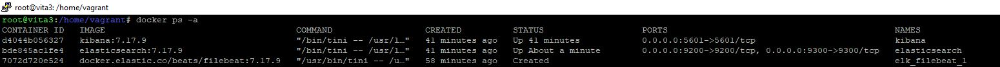   

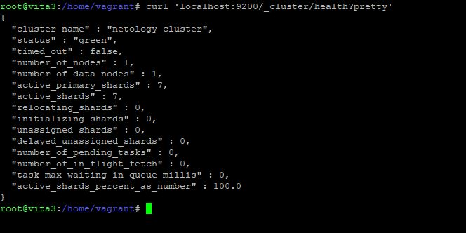   

---  


### Задание 2. Kibana  

Установите и запустите Kibana.  


*Приведите скриншот интерфейса Kibana на странице http://<ip вашего сервера>:5601/app/dev_tools#/console, где будет выполнен запрос GET /_cluster/health?pretty.*  

### Решение:   

- Т.к. Kibana была установлена в контейнере из docker-compose файла, заходим в веб-интерфейс, используя порт 5601 и выполняем команду в **dev tools**:

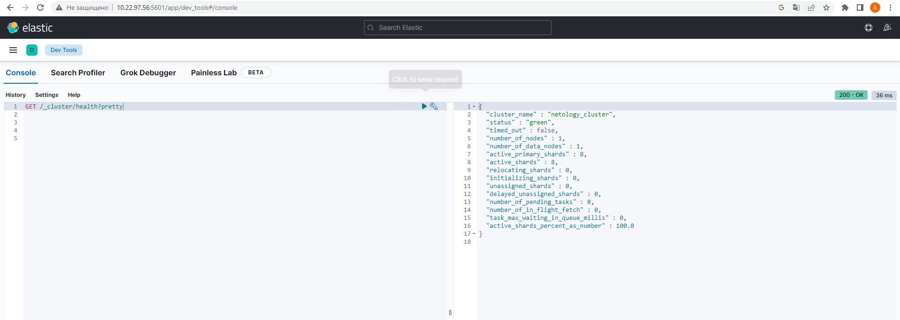    


---  

### Задание 3. Logstash  

Установите и запустите Logstash и Nginx. С помощью Logstash отправьте access-лог Nginx в Elasticsearch.  


*Приведите скриншот интерфейса Kibana, на котором видны логи Nginx.*    

### Задание 4. Filebeat.  

Установите и запустите Filebeat. Переключите поставку логов Nginx с Logstash на Filebeat.  


*Приведите скриншот интерфейса Kibana, на котором видны логи Nginx, которые были отправлены через Filebeat.*

### Решение:     

*Уважаемые друзья, уже второй день не могу решить проблему с logstash. Логи в эластик тупо не идут. Пробовал по-равзному.  
Для начала, я решил запихнуть все сервисы в контейнеры (смотрите приложенный docker-compose.yaml и конфигурационные файлы, которые я прокидывал).  
Файлбит сразу же включился и начал мониторить мой доккер:*    

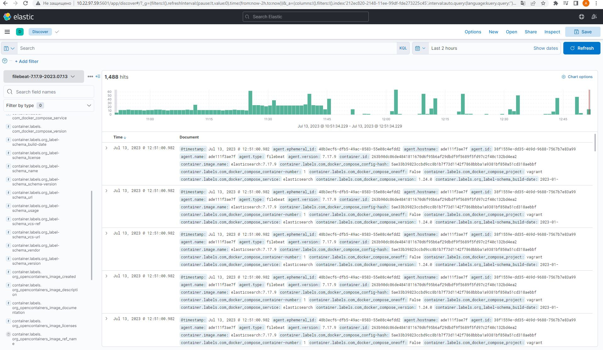    

*Видим файлбит и на самом эластике:*    

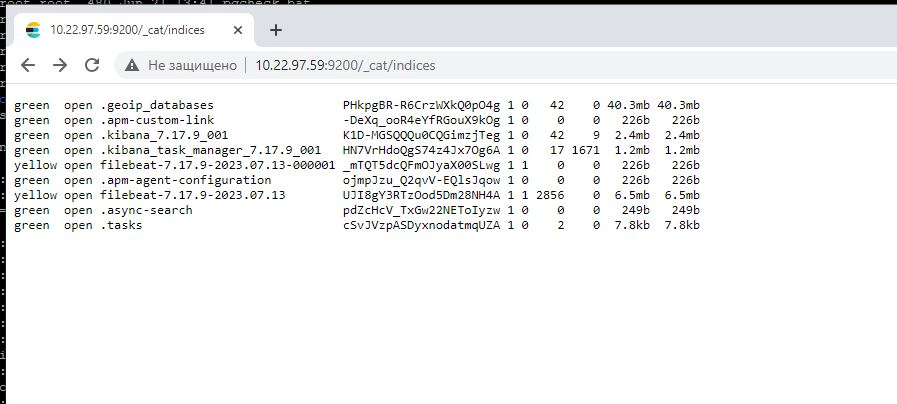  

*Мои контейнеры:*  

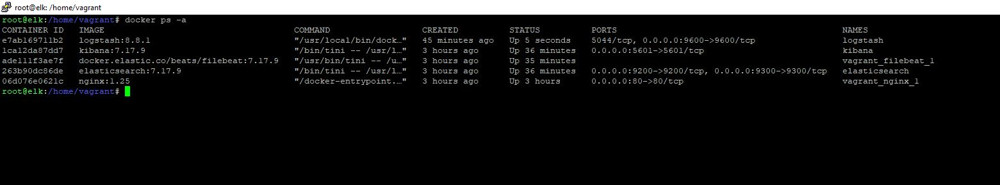   

*Логи **docker logs** логстэша. Не вижу ничего, в чем могла бы быть проблема:*  

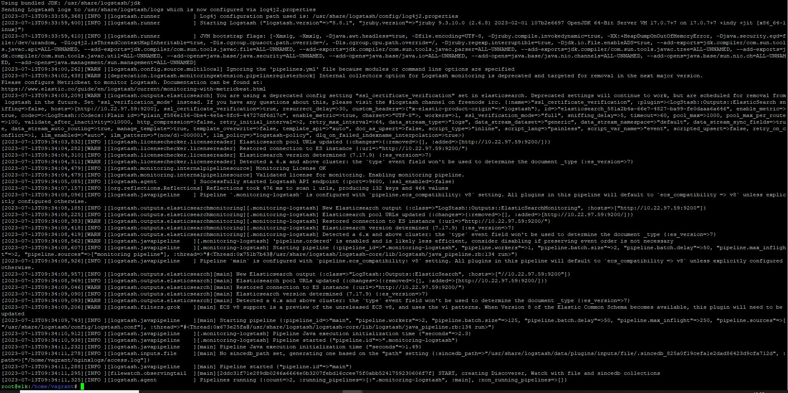   

*На файл **/home/vagrant/nginxlogs/access.log**, на который смотрит logstash раздал chmod 777.*  

*Не уепляет и все. Второй день бьюсь. Что делать? Где косяк? Все файлы конфигурации смотрите в docker-compose папке.*    

*Также, я пробовал убирать контейнер с логсташ и устанавливать его прямо на машину. Вносил конфигурацию в файл **/etc/logstash/conf.d/my_conf.conf**, перезапускал сервис - ничего.  
Пробовал запускать конфиг файл прямо из директории **/usr/share/logstash/bin** командой **./logstash -f <путь до конфиг файла>** - ничего.*  

*Я в тупике.*  

### Доработка  

Итак, из тупика мне, все-таки, удалось немного выйти.  
Первая ошибка, которую я нашел была прямо перед глазами.  
Дело в том, что в разделе  **input** logstash.conf файла, я ссылался на файл на хосте, который не был прокинут в контейнер с logstash.  
Поправил (смотрите обновленный docker-compose.yaml), но проблема не ушла.  
Я сделал самый простой конфиг для теста передачи лога:  
```  
input {
        file {
        path => "/usr/share/logstash/nginx/access.log"
        start_position => "beginning"
        }
}

output {
         file {
         path => "/usr/share/logstash/output.txt"
         }


}
```  
Но, даже в этом случае, данные не записывались в *output.txt*.  
После этого я решил посмотреть каким юзером я являюсь в контейнере и, выполнив команду **docker exec <container_id> whoami** обнаружил себя пользователем logstash.  

Что ж. Правим docker-compose.yaml файл, пересобираем контейнер с необходимой конфигурацией:  
```
input {
        file {
        path => "/usr/share/logstash/nginx/access.log"
        start_position => "beginning"
        }
}


filter {
        grok {
        match => { "message" => "%{IPORHOST:remote_ip} - %{DATA:user_name}
        \[%{HTTPDATE:access_time}\] \"%{WORD:http_method} %{DATA:url}
        HTTP/%{NUMBER:http_version}\" %{NUMBER:response_code} %{NUMBER:body_sent_bytes}
        \"%{DATA:referrer}\" \"%{DATA:agent}\"" }
        }
        mutate {
        remove_field => [ "host" ]
        }
}


#output {
#
#         file {
#         path => "/usr/share/logstash/output.txt"
#         }
#
#}


output {
        elasticsearch {
        hosts => "10.22.97.59:9200"
        data_stream => "true"
        }
}
```  
и.....**НАКОНЕЦ-ТО!!!**:    


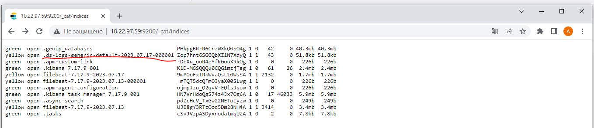  

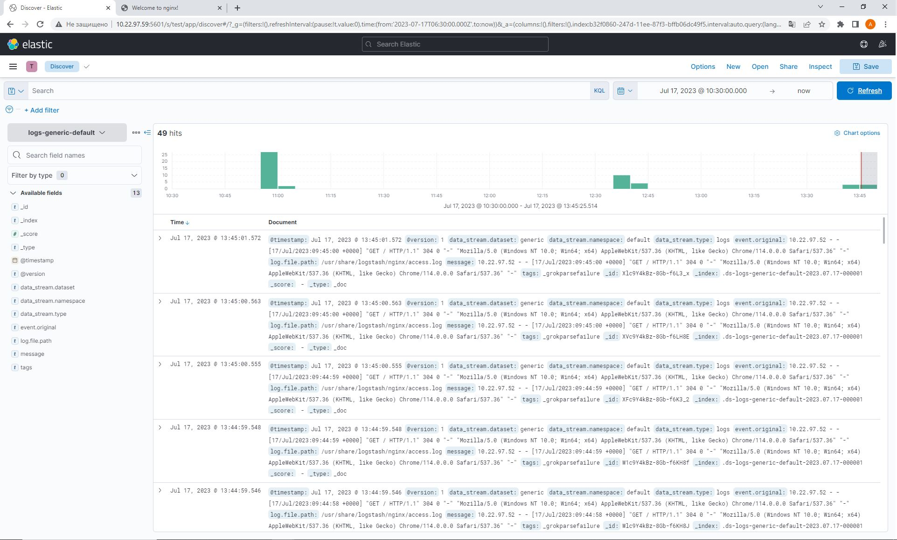  

Да, я понимаю, что, вероятно, неправильно запускать контейнер с logstash под рутом. Видимо, он не просто так поднимается под своим пользователем. И, полагаю, нужно добавить этого пользователя в эластик, но на данном этапе я не стал копать глубже.


Теперь попробуем перекинуть поставку логов с logstash на filebeat.    

Правим наш уже существующий файл **filebeat.yaml** на поставку логов из access.log Nginx'а:  

```
filebeat.inputs:
- type: log
  paths:
    - '/usr/share/filebeat/nginx/access.log'

#processors:
#- add_docker_metadata:
#    host: "unix:///var/run/docker.sock"

#- decode_json_fields:
#    fields: ["message"]
#    target: "json"
#    overwrite_keys: true

output.elasticsearch:
  hosts: ["10.22.97.59:9200"]
  indices:
    - index: "filebeat_nginx-%{[agent.version]}-%{+yyyy.MM.dd}"

logging.json: true
logging.metrics.enabled: false

```  

Смотрим, схватил ли его эластик:  

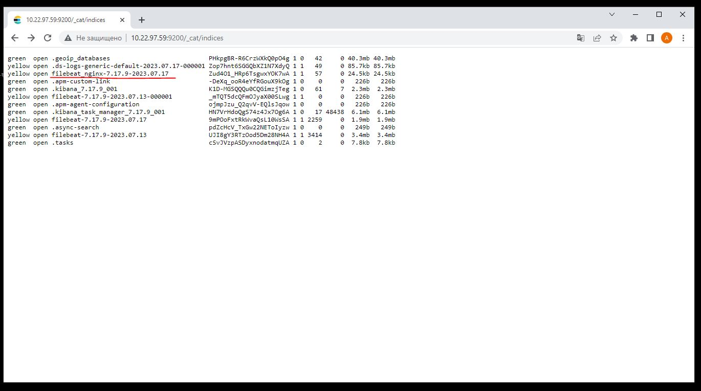  

Схватил. Теперь создадим еще один паттерн в кибане, добавим новый индекс и посмотрим, все ли хорошо:  

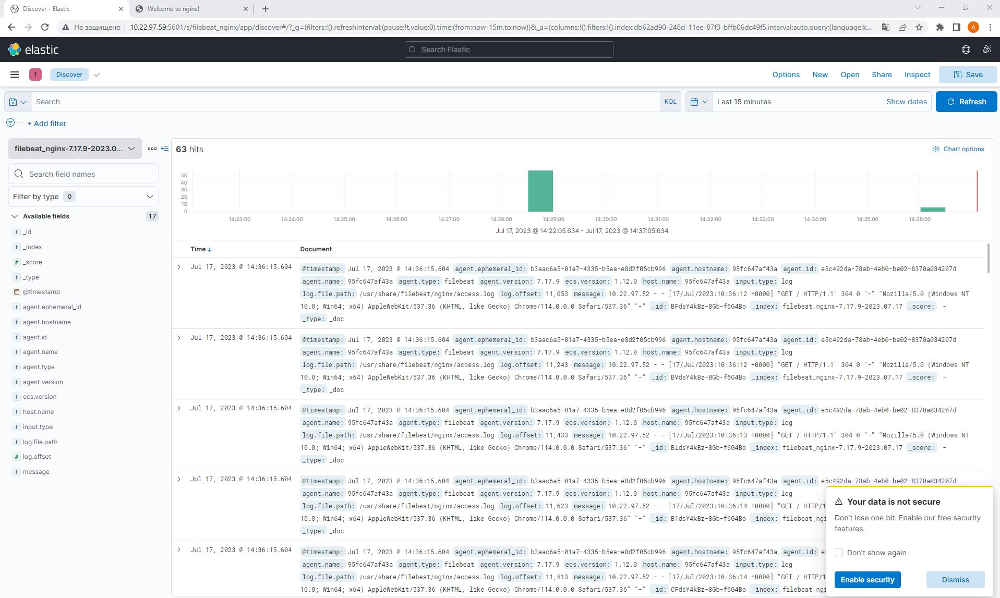  

Все отлично!  

P.S. Все файлы конфигураций и docker-compose файл лежат в папке, приложенной к данному репозиторию.


